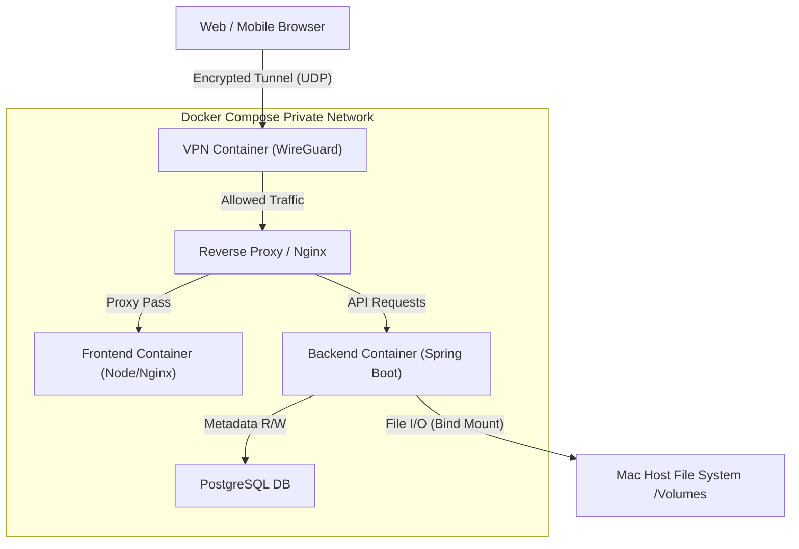
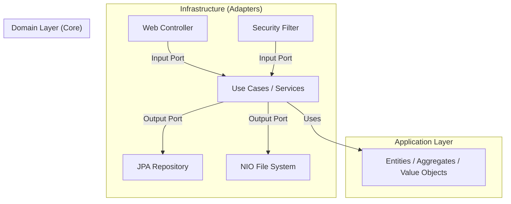

# Technical Architecture & Module Specification

**Parent Document:** [00_master_spec.md](./00_master_spec.md)
**Version:** 1.2.0
**Date:** 2026-01-04
**Updates:** Adopting DDD, Hexagonal Architecture, and MapStruct.

---

## 1. System Architecture Overview

The system follows a **VPN-Gated Client-Server Architecture** hosted within a containerized environment (Docker).
The Host Machine (Mac) provides the compute resources and the physical storage. **Crucially, the Web Application is NOT exposed to the public internet.** It is only accessible via a secure VPN tunnel.

### 1.1 High-Level Container Diagram



---

## 2. Backend Architecture (Java / Spring Boot)

We adopt **Domain-Driven Design (DDD)** principles implemented via **Hexagonal Architecture (Ports & Adapters)**. This ensures the core business logic remains independent of frameworks, databases, and external interfaces.

### 2.1 Core Technology Stack
- **Java Version:** Java 21 LTS (utilizing Virtual Threads).
- **Framework:** Spring Boot 3.x.
- **Build System:** Gradle (Kotlin DSL).
- **Mapping:** **MapStruct** (Strict mapping between layers).
- **Database Access:** Spring Data JPA + QueryDSL.
- **Security:** Spring Security 6 (Stateless JWT).

### 2.2 Conceptual Architecture (Hexagonal)



### 2.3 Package Structure (Bounded Contexts)
The project is divided into Bounded Contexts. Each context follows the Hexagonal structure.

```text
com.mac.private-nas
├── common/                     # Shared kernel (Value Objects, Base Classes)
├── context/
│   ├── auth/                   # [Bounded Context] Authentication & User Mgmt
│   │   ├── domain/             # Entities (User), VOs (Password, Role)
│   │   ├── application/        # Ports (in/out), UseCases (LoginUseCase)
│   │   └── infrastructure/     # Adapters (AuthController, JpaUserRepository, JwtProvider)
│   │
│   ├── file/                   # [Bounded Context] File Operations
│   │   ├── domain/             # Entities (FileMetadata), Services (FileValidator)
│   │   ├── application/        # Ports (FileStoragePort), UseCases (UploadFileUseCase)
│   │   └── infrastructure/     # Adapters (FileController, LocalFileSystemAdapter)
│   │
│   └── system/                 # [Bounded Context] Admin & Monitoring
│       ├── domain/             # Entities (SystemMetric, AuditLog)
│       └── ...
└── PrivateNasApplication.java
```

### 2.4 Data Mapping Strategy (MapStruct)
Strict separation of data models requires explicit mapping. **Direct leakage of JPA Entities to the Web Layer is forbidden.**

*   **Web Layer:** Uses `RequestDTO` / `ResponseDTO`.
*   **Application Layer:** Uses `Command` / `Result` (POJOs).
*   **Domain Layer:** Uses `Domain Entities`.
*   **Infrastructure (Persistence):** Uses `JpaEntity`.

**Flow & Mapping:**
1.  `Controller` receives `RequestDTO`.
2.  `MapStruct` converts `RequestDTO` -> `Command`.
3.  `UseCase` executes logic using `Domain Entities`.
4.  `UseCase` calls `OutputPort` (Repository).
5.  `Repository Adapter` converts `Domain Entity` -> `JpaEntity` (via MapStruct) and saves.
6.  Return path reverses this process.

### 2.5 Key Module Responsibilities

#### A. Auth Context (`/context/auth`)
- **Domain:** `User`, `Role`, `Password` (VO). Logic for password strength, account locking.
- **Application:** `LoginUseCase`, `RotateTokenUseCase`.
- **Infra:**
  - `Web`: `AuthController` (REST).
  - `Security`: `CustomUserDetailsService` (Spring Security Adapter).
  - `Persistence`: `UserEntity` (JPA), `UserRepositoryAdapter`.

#### B. File Context (`/context/file`)
- **Domain:** `VirtualFile`, `FileAttributes` (Size, MimeType). Domain logic for file naming collisions.
- **Application:** `UploadFileUseCase`, `ListDirectoryUseCase`.
- **Infra:**
  - `Web`: `FileController` (REST).
  - `FileSystem`: `LocalDiskAdapter` (Implements `FileStoragePort` using `java.nio`).
    - *Note:* This adapter handles the actual I/O with Mac volumes.

---

## 3. Frontend Architecture (TypeScript)

### 3.1 Core Technology Stack
- **Framework:** React 18+ (Vite).
- **Language:** TypeScript 5.x.
- **State:** TanStack Query + Zustand.
- **UI:** Material UI (MUI).

### 3.2 Feature-Sliced Design (FSD)
Aligning with the backend's domain separation.

```text
src/
├── app/                    # Providers, Global Styles
├── entities/               # Business entities (User, FileNode)
│   ├── user/
│   └── file/
├── features/               # User interactions (Auth, FileBrowser)
│   ├── login/              # UI + Logic for logging in
│   ├── file-tree/          # Recursive file tree viewer
│   └── file-actions/       # Upload, Delete, Rename logic
├── widgets/                # Composition of features (Header, Sidebar)
├── pages/                  # Routing pages (Dashboard, Settings)
└── shared/                 # UI Kit, API Client, Utils
```

---

## 4. Infrastructure & Deployment

### 4.1 Docker Composition
The `docker-compose.yml` defines the services.

1.  **`vpn-server`** (WireGuard):
    -   **Exposed Port:** UDP (e.g., 51820) mapped to Host.
    -   **Role:** Entry point for all external traffic.
2.  **`nas-backend`**:
    -   **Volumes:** `/Volumes:/mnt/host_volumes:rw` (Mac External Drives).
    -   **Network:** Internal only (No ports exposed to host).
3.  **`nas-frontend`**:
    -   **Network:** Internal only.
4.  **`nas-db`**:
    -   **Network:** Internal only.

---

## 5. Development Standards

### 5.1 Rules
1.  **No Cyclic Dependencies:** Domain layer must not depend on Infrastructure.
2.  **MapStruct Usage:** Every layer transition requiring data transformation must use a defined Mapper interface.
3.  **Testing:**
    -   **Domain:** Pure Unit Tests (No Spring Context).
    -   **Application:** Unit Tests with Mocked Ports.
    -   **Infrastructure:** Integration Tests (`@SpringBootTest`, Testcontainers).

### 5.2 Code Style
-   **Backend:** Google Java Style.
-   **Frontend:** Prettier + ESLint.
