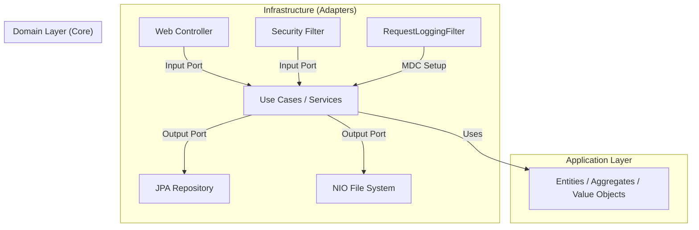

# Technical Architecture & Module Specification

**Parent Document:** [00_master_spec.md](./00_master_spec.md)
**Version:** 1.3.0
**Date:** 2026-01-10
**Updates:** Added Observability & Logging Architecture.

---

## 1. System Architecture Overview

The system follows a **VPN-Gated Client-Server Architecture** hosted within a containerized environment (Docker).
The Host Machine (Mac) provides the compute resources and the physical storage. **Crucially, the Web Application is NOT exposed to the public internet.** It is only accessible via a secure VPN tunnel.

### 1.1 High-Level Container Diagram

```mermaid
graph TD
    UserClient[Web / Mobile Browser] -->|"Encrypted Tunnel (UDP)"| VPN_Server["VPN Container (WireGuard)"]
    
    subgraph "Docker Compose Private Network"
        VPN_Server -->|Allowed Traffic| Nginx[Reverse Proxy / Nginx]
        Nginx -->|Proxy Pass (X-Trace-ID)| Frontend["Frontend Container (Node/Nginx)"]
        Nginx -->|API Requests (X-Trace-ID)| Backend["Backend Container (Spring Boot)"]
        Backend -->|Metadata R/W| Database[PostgreSQL DB]
    end
    
    Backend -->|"File I/O (Bind Mount)"| MacOS_FS[Mac Host File System /Volumes]
```

---

## 2. Backend Architecture (Java / Spring Boot)

We adopt **Domain-Driven Design (DDD)** principles implemented via **Hexagonal Architecture (Ports & Adapters)**. This ensures the core business logic remains independent of frameworks, databases, and external interfaces.

### 2.1 Core Technology Stack
- **Java Version:** Java 25 LTS (utilizing Virtual Threads).
- **Framework:** Spring Boot 4.x.
- **Build System:** Gradle (Kotlin DSL).
- **Mapping:** **MapStruct** (Strict mapping between layers).
- **Database Access:** Spring Data JPA + QueryDSL.
- **Security:** Spring Security 6 (Stateless JWT).
- **Logging:** SLF4J + Logback (JSON Format optional).

### 2.2 Conceptual Architecture (Hexagonal)



### 2.3 Package Structure (Bounded Contexts)
The project is divided into Bounded Contexts. Each context follows the Hexagonal structure.

```text
com.mac.private-nas
├── common/                     # Shared kernel
│   ├── tracing/                # [New] TraceIdFilter, MdcUtils
│   └── exception/              # GlobalExceptionHandler
├── context/
│   ├── auth/                   # [Bounded Context] Authentication
│   ├── file/                   # [Bounded Context] File Operations
│   └── system/                 # [Bounded Context] System & Audit
│       ├── domain/             # AuditLog Entity
│       └── application/        # AuditService
└── PrivateNasApplication.java
```

### 2.4 Observability Strategy

We implement a **Correlation ID** pattern for end-to-end tracing.

1. **Frontend:**
    - Interceptors (Axios/Fetch) inject `X-Trace-ID` (UUID) into every header.
2. **Backend (Filter):**
    - `TraceIdFilter` reads `X-Trace-ID` or generates a new one if missing.
    - Sets `MDC.put("traceId", id)`.
    - Adds `X-Trace-ID` to the response header.
3. **Logs:**
    - Logback pattern includes `%X{traceId}`.
4. **Audit:**
    - `AuditService` captures the Trace ID from MDC when saving `AuditLog` entities.

---

## 3. Frontend Architecture (TypeScript)

### 3.1 Core Technology Stack
- **Framework:** React 18+ (Vite).
- **Language:** TypeScript 5.x.
- **State:** TanStack Query + Zustand.
- **UI:** Material UI (MUI).
- **HTTP Client:** Axios (configured with interceptors for Tracing).

### 3.2 Feature-Sliced Design (FSD)
Aligning with the backend's domain separation.

```text
src/
├── app/                    # Providers, Global Styles
├── entities/               # Business entities (User, FileNode)
├── features/               # User interactions
├── widgets/                # Composition of features
├── pages/                  # Routing pages
└── shared/                 # UI Kit, API Client (Axios Instance)
```

---

## 4. Infrastructure & Deployment

### 4.1 Docker Composition
The `docker-compose.yml` defines the services.

1.  **`vpn-server`** (WireGuard):
    -   **Exposed Port:** UDP (e.g., 51820) mapped to Host.
    -   **Role:** Entry point for all external traffic.
2.  **`nas-backend`**:
    -   **Volumes:** `/Volumes:/mnt/host_volumes:rw` (Mac External Drives).
    -   **Network:** Internal only (No ports exposed to host).
3.  **`nas-frontend`**:
    -   **Network:** Internal only.
4.  **`nas-db`**:
    -   **Network:** Internal only.

---

## 5. Development Standards

### 5.1 Rules
1.  **No Cyclic Dependencies:** Domain layer must not depend on Infrastructure.
2.  **MapStruct Usage:** Every layer transition requiring data transformation must use a defined Mapper interface.
3.  **Testing:**
    -   **Domain:** Pure Unit Tests (No Spring Context).
    -   **Application:** Unit Tests with Mocked Ports.
    -   **Infrastructure:** Integration Tests (`@SpringBootTest`, Testcontainers).

### 5.2 Code Style
-   **Backend:** Google Java Style.
-   **Frontend:** Prettier + ESLint.
